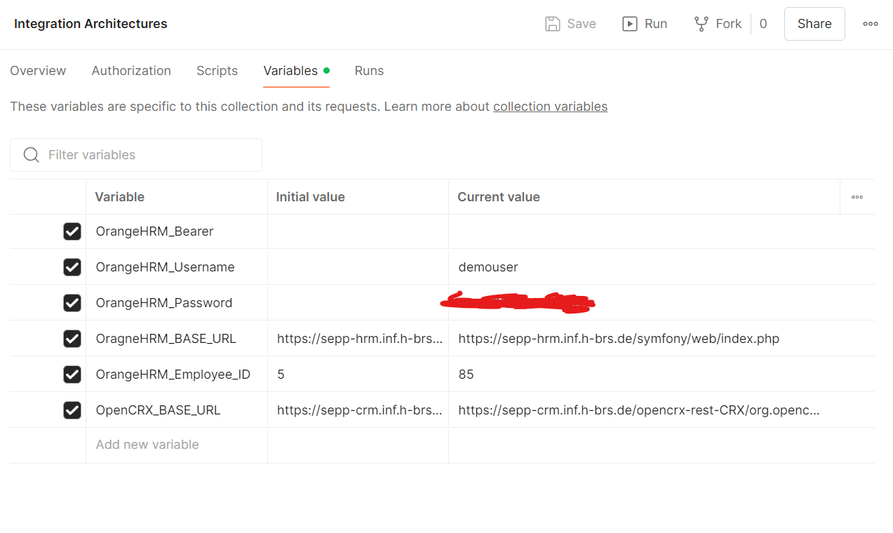
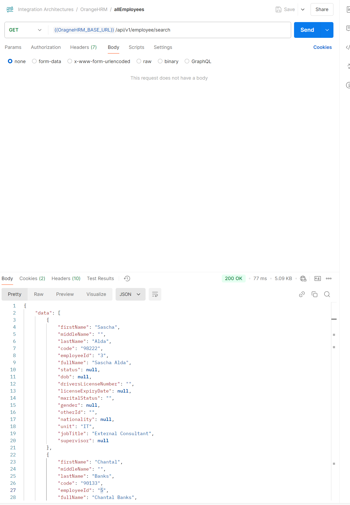
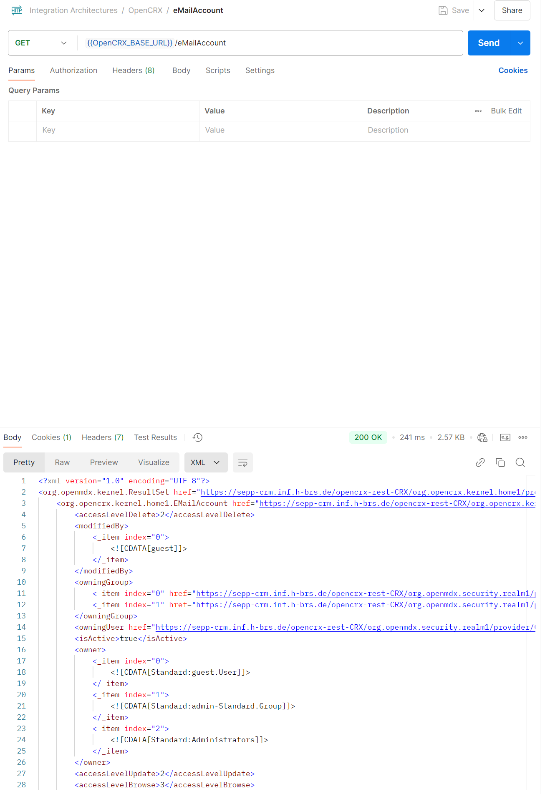

Here you can find our exported Postman Collection. You can import them in Postman and should have alle the API-Calls. 
You can also find requestBearerTokenOrangeHRM.js which is the script we used for dynamic Bearer Token generation. You will find more information on that in Assignment C.
A couple Picutres of our Calls:
 

