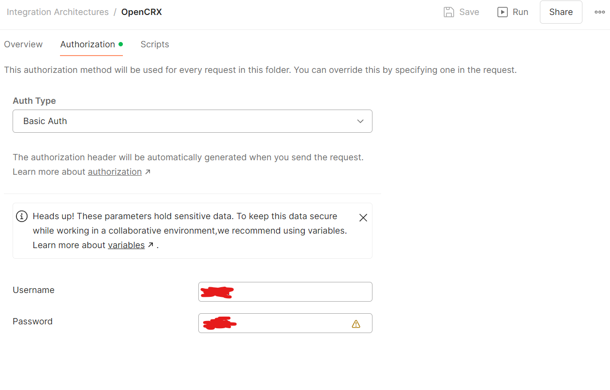
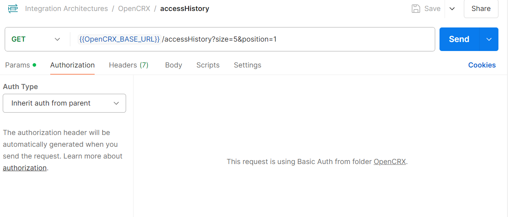

## Authentications

### Bearer Token
The implementation of the Bearer Authentication for Postman can be found in the File
```
requestBearerTokenOrangeHRM.js
```
in this directory.

### Password
The implemenation of the Password authorization is done in Postman itself. <br> 
The Username and Password are set for the Collection and then inherited in every API-Call

#### Folder Configuration


#### API-Call Exanple 
